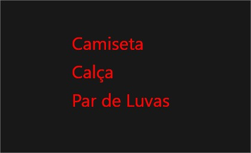
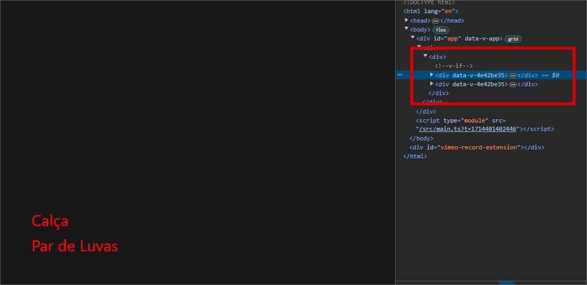
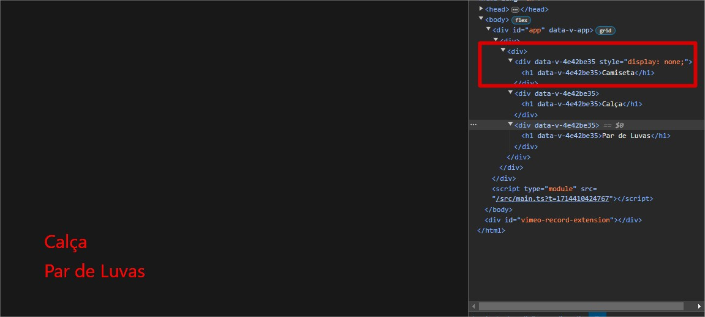
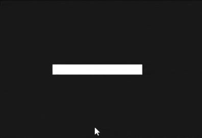

# Props e diretivas

## Tabela de conteúdo

- [Introdução](#introdução)
- [Props](#props)
  - [Prop Drilling](#prop-drilling)
- [Diretivas](#diretivas)
  - [v-if](#v-if)
  - [v-else](#v-else)
  - [v-else-if](#v-else-if)
  - [v-show](#v-show)
  - [v-for](#v-for)
  - [v-bind](#v-bind)
  - [v-on](#v-on)
  - [v-model](#v-model)

## Introdução

Props e diretivas são recursos do Vue.js que permitem a comunicação entre componentes e a manipulação do DOM.

Elas são muito utilizadas para passar dados entre componentes, controlar a renderização de elementos e manipular eventos.

## Props

Props são atributos personalizados que podem ser registrados em um componente. Quando um valor é passado para um prop, ele se torna uma propriedade do componente.

Usando nossos conhecimentos anteriores, vamos utilizar nosso componente `ProductDetail` para exemplificar o uso de props.

- ProductListView.vue

```vue
<template>
  <div>
    <ProductDetail name="Camiseta" />
    <ProductDetail name="Calça" />
    <ProductDetail name="Par de Luvas" />
  </div>
</template>
```

Em nosso exemplo, estamos passando a propriedade `name` para o componente `ProductDetail`. Para acessar essa propriedade, precisamos registrá-la em nosso componente.

- ProductDetail.vue

```vue
<template>
  <div>
    <h1>{{ props.name }}</h1>
  </div>
</template>

<script setup lang="ts">
// Agora mudamos nosso componente de options API para composition API
const props = defineProps({
  name: String
})
</script>
```

O resultado será esse:


Perceba que cada instância do componente `ProductDetail` recebeu um valor diferente para a propriedade `name`, dessa forma conseguimos personalizar cada componente de forma independente.

### Prop Drilling

Mas atenção no uso de props, caso árvore de componentes seja muito grande, a passagem de props pode se tornar complexa e difícil de manter, isso também é chamado de "Prop Drilling".

Exemplo de prop drilling:

```vue
<!-- Componente Pai -->
<template>
  <div>
    <!-- Filho 01 -->
    <Componente01 prop="Prop Drilling" />
  </div>
</template>
```

```vue
<template>
  <div>
    <!-- Filho do filho 01 -->
    <Componente02 :prop="prop" />
  </div>
</template>

<script setup lang="ts">
const props = defineProps({
  prop: String
})
</script>
```

```vue
<template>
  <div>
    <!-- Filho do filho 02 -->
    <Componente03 :prop="prop" />
  </div>
</template>

<script setup lang="ts">
const props = defineProps({
  prop: String
})
</script>
```

```vue
<template>
  <div>
    <!-- Filho do filho 03 -->
    <Componente04 :prop="prop" />
  </div>
</template>

<script setup lang="ts">
const props = defineProps({
  prop: String
})
</script>
```

Nesse exemplo, o componente `Componente04` precisa da propriedade `prop`, mas para acessá-la, precisamos passar a propriedade `prop` do componente pai para o componente `Componente01`, depois para o componente `Componente02` e por fim para o componente `Componente03` e `Componente04`. Isso é chamado de "Prop Drilling" e pode se tornar complexo e difícil de manter.

Para evitar esse problema, podemos utilizar outra biblioteca para gerenciamento de estado, na versão 2 do Vue era muito utilizado o Vuex, mas na versão 3 do Vue, a própria equipe do Vue recomenda o uso do [Pinia](https://pinia.esm.dev/) que é o seu sucessor. Esse tópico será abordado mais para frente.

## Diretivas

Diretivas são atributos especiais que são aplicados a elementos HTML. Elas são prefixadas com `v-` para indicar que são diretivas especiais fornecidas pelo Vue.

### v-if

A diretiva `v-if` é usada para renderizar um bloco de código com base em uma expressão booleana (true ou false).

```vue
<template>
  <div>
    <ProductDetail name="Camiseta" v-if="isProductVisible" />
    <ProductDetail name="Calça" />
    <ProductDetail name="Par de Luvas" />
  </div>
</template>
```

Nesse exemplo, o componente `ProductDetail` com o nome "Camiseta" só será renderizado se a propriedade `isProductVisible` for verdadeira.

Algo a ser considerado ao utilizar a diretiva `v-if` é que o elemento não é renderizado no DOM se a expressão for falsa, como exemplificado na imagem abaixo:



### v-else

A diretiva `v-else` é usada para renderizar um bloco de código se a expressão do `v-if` for falsa.

```vue
<template>
  <div>
    <ProductDetail name="Camiseta branca" v-if="isAvailable" />
    <ProductDetail name="Camiseta vermelha" v-else />
  </div>
</template>
```

Nesse exemplo, o componente `ProductDetail` com o nome "Camiseta branca" será renderizado se a propriedade `isAvailable` for verdadeira, caso contrário, o componente `ProductDetail` com o nome "Camiseta vermelha" será renderizado.

### v-else-if

A diretiva `v-else-if` é usada para adicionar condições adicionais a um bloco de código.

```vue
<template>
  <div>
    <ProductDetail name="Camiseta branca" v-if="isAvailable && color === 'white'" />
    <ProductDetail name="Camiseta preta" v-else-if="isAvailable && color === 'black'" />
    <ProductDetail name="Camiseta vermelha" v-else />
  </div>
</template>
```

Nesse exemplo, o componente `ProductDetail` com o nome "Camiseta branca" será renderizado se a propriedade `isAvailable` for verdadeira e a propriedade `color` for igual a "white", caso contrário, o componente `ProductDetail` com o nome "Camiseta preta" será renderizado se a propriedade `isAvailable` for verdadeira e a propriedade `color` for igual a "black" e caso nenhuma das condições seja atendida, o componente `ProductDetail` com o nome "Camiseta vermelha" será renderizado.

### v-show

A diretiva `v-show` é usada para renderizar um bloco de código com base em uma expressão booleana (true ou false), mas diferente da diretiva `v-if`, o elemento é renderizado no DOM, porém com a propriedade `display: none` se a expressão for falsa.

```vue
<template>
  <div>
    <ProductDetail name="Camiseta" v-show="isProductVisible" />
    <ProductDetail name="Calça" />
    <ProductDetail name="Par de Luvas" />
  </div>
</template>
```

Nesse exemplo, o componente `ProductDetail` com o nome "Camiseta" só será renderizado se a propriedade `isProductVisible` for verdadeira, mas o elemento será renderizado no DOM com a propriedade `display: none` se a propriedade for falsa.

Isso é útil quando você deseja alternar a visibilidade de um elemento sem recriá-lo, mas ao mesmo tempo, pode afetar a performance da aplicação dependendo da quantidade de elementos que estão sendo renderizados.

Abaixo como o elemento aparece no DOM com a propriedade `display: none`:



### v-for

A diretiva `v-for` é usada para renderizar uma lista de elementos com base em um array.

```vue
<template>
  <div>
    <ProductDetail v-for="product in products" :key="product.id" :name="product.name" />
  </div>
</template>

<script setup lang="ts">
import { ref } from 'vue'
import ProductDetail from '@/components/ProductDetail.vue'

const products = ref([
  { id: 1, name: 'Camiseta' },
  { id: 2, name: 'Calça' },
  { id: 3, name: 'Par de Luvas' }
])
</script>
```

Nesse exemplo, o componente `ProductDetail` será renderizado para cada item do array `products`.

Outras formas de se escrever o `v-for`:

```vue
<!-- Iterando sobre um array e obtendo a posição de cada item -->
<div v-for="(product, index) in products" :key="index">
  {{ product.name }}
</div>

<!-- Iterando sobre um objeto e obtendo a chave e o valor de cada item -->
<div v-for="(value, key) in object">
  {{ key }}: {{ value }}
</div>

<!-- Iterando sobre um número de vezes -->
<div v-for="n in 10" :key="n">
  {{ n }}
</div>

<!-- Iterando sobre um array de objetos -->
<div v-for="{ id, name } in products" :key="id">
  {{ name }}
</div>
```

### v-bind

A diretiva `v-bind` é usada para associar dinamicamente um ou mais atributos HTML a uma expressão.

```vue
<template>
  <div>
    <a v-bind:href="url">Link</a>
  </div>
</template>

<script setup lang="ts">
const url = 'https://www.google.com'
</script>
```

Nesse exemplo, o atributo `href` do elemento `a` será associado ao valor da variável `url`.

Você pode também usar a sintaxe abreviada `:` para `v-bind`:

```vue
<a :href="url">Link</a>
```

O v-bind pode ser utilizado para associar qualquer atributo HTML a uma expressão.

### v-on

A diretiva `v-on` é usada para anexar eventos a elementos HTML.

```vue
<template>
  <div>
    <button v-on:click="handleClick">Clique aqui</button>
  </div>
</template>

<script setup lang="ts">
const handleClick = () => {
  alert('Botão clicado!')
}
</script>
```

Nesse exemplo, o evento `click` do elemento `button` será associado à função `handleClick`.

Você pode também usar a sintaxe abreviada `@` para `v-on`:

```vue
<button @click="handleClick">Clique aqui</button>
```

### v-model

A diretiva `v-model` é usada para criar uma ligação bidirecional entre um elemento de formulário e um estado.

```vue
<template>
  <div>
    <input v-model="name" />
    <p>{{ name }}</p>
  </div>
</template>

<script setup lang="ts">
import { ref } from 'vue'

const name = ref('')
</script>
```

Nesse exemplo, o valor do input será associado ao valor da variável `name` e qualquer alteração no input será refletida no parágrafo abaixo.

A diretiva `v-model` é uma abreviação para a diretiva `v-bind` e `v-on` juntas.

Veja no gif abaixo como a diretiva `v-model` funciona:


