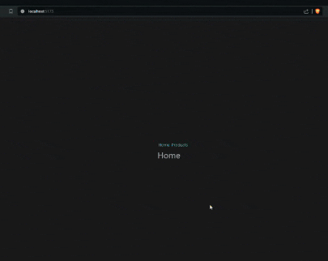
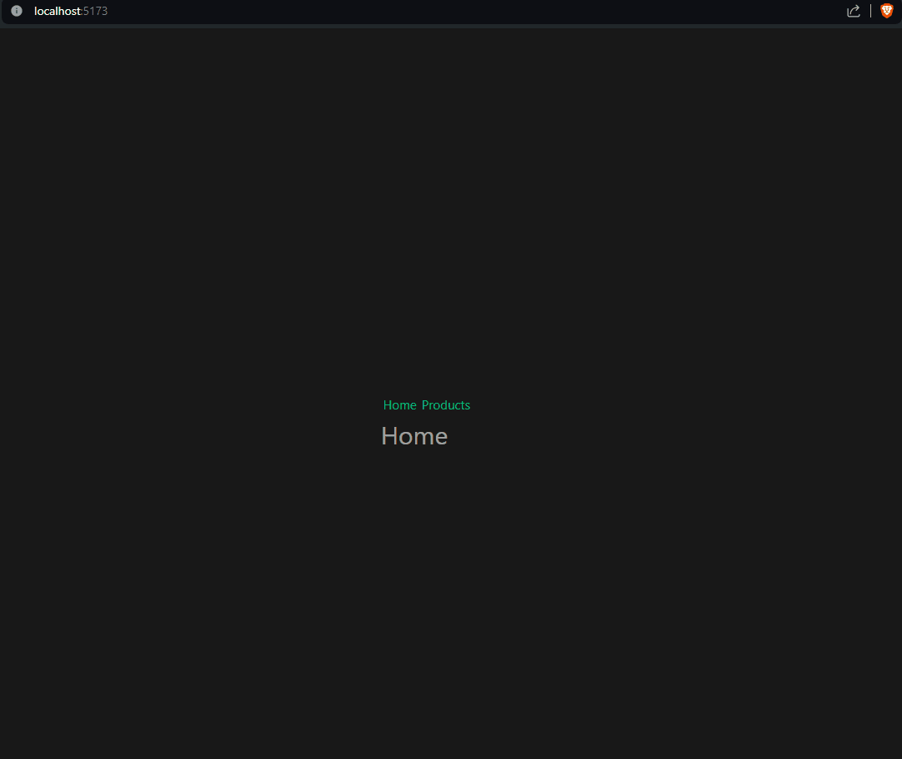
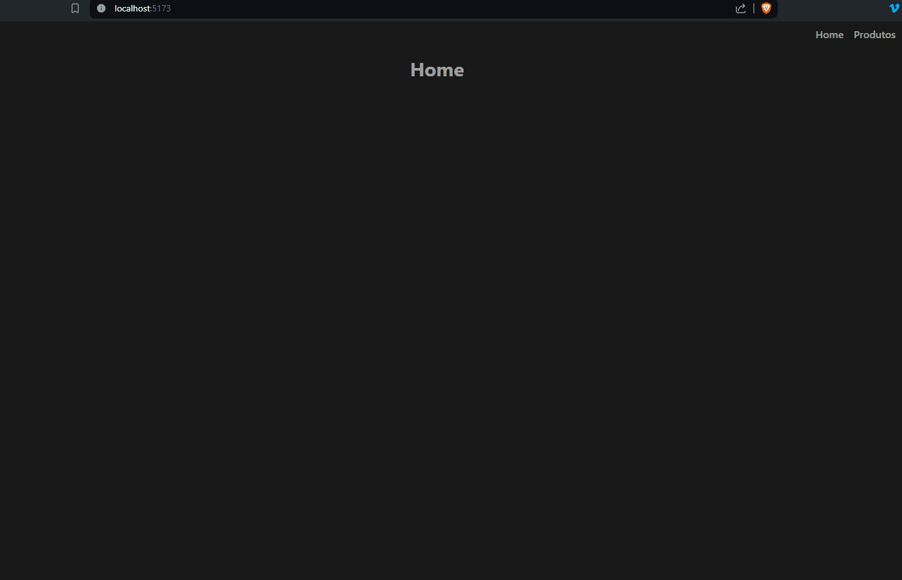

# Roteamento

## Tabela de conteúdo

- [Introdução](#introdução)
- [Instalação](#instalação)
- [Configuração](#configuração)
- [Navegação](#navegação)
  - [Router-link](#router-link)
  - [Programática](#programática)
- [Parâmetros](#parâmetros)
- [Redirecionamento](#redirecionamento)
- [Criando rotas](#criando-rotas)
- [Estilos e refatoração](#estilos-e-refatoração)

## Introdução

O roteamento é um recurso essencial em aplicações web modernas. Ele permite a navegação entre diferentes páginas sem a necessidade de recarregar a página.

O Vue Router é a biblioteca oficial de roteamento para o Vue.js. Ele é um plugin que permite adicionar rotas à sua aplicação.

Nesse momento iremos apenas abordar os conceitos básicos do Vue Router. Para informações mais detalhadas, consulte a [documentação oficial](https://next.router.vuejs.org/).

## Instalação

Para instalar o Vue Router, execute o seguinte comando:

```bash
npm install vue-router@next
```

## Configuração

Para configurar o Vue Router, você precisa importá-lo em seu arquivo de entrada (geralmente `main.ts`).

```javascript
import './assets/main.css'

import { createApp } from 'vue'
import { createPinia } from 'pinia'

import App from './App.vue'
import router from './router' // <== Importe o arquivo de configuração do Vue Router

const app = createApp(App)

app.use(createPinia())
app.use(router)

app.mount('#app')
```

No nosso exemplo acima, separaremos a configuração do Vue Router em um arquivo separado chamado `router.ts`.

router/index.ts

```javascript
import { createRouter, createWebHistory } from 'vue-router'

const router = createRouter({
  history: createWebHistory(import.meta.env.BASE_URL),
  routes: []
})

export default router
```

Aqui, estamos criando uma instância do Vue Router e exportando-a para que possamos usá-la em nosso arquivo de entrada.

Nesse exemplo estamos criando um sistema de rotas vazio. Adicionaremos rotas posteriormente.

Perceba o uso de `import.meta.env.BASE_URL`. Isso é necessário para que o Vue Router funcione corretamente, pois ele usa a URL base da aplicação.

Pontos importantes:

- `createWebHistory` - Cria uma instância de histórico baseada na API de histórico do navegador, poderia ser utilizado também `createWebHashHistory` por exemplo, para criar uma instância de histórico baseada em hash, útil para aplicações que não podem ser configuradas para redirecionar URLs para o servidor.
- `import.meta.env` - O Vite fornece um objeto `import.meta.env` que contém variáveis de ambiente e pode ser usado para acessa-las em tempo de compilação.

## Navegação

### Router-link

O componente `router-link` é usado para navegar entre páginas em um aplicativo Vue. Ele é semelhante ao componente `a` do HTML, mas com algumas diferenças.

```html
<router-link to="/about">About</router-link>
```

Nesse exemplo acima, estamos criando um link para a rota `/about` e diferente do componente `a`, o `router-link` não recarrega a página, ele apenas atualiza a URL e o componente `router-view` (veremos mais a frente), renderiza o componente correspondente à rota.

### Programática

Você também pode navegar programaticamente usando o objeto `$router`.

```javascript
this.$router.push('/about')
```

O objeto `$router` é injetado em todos os componentes Vue e pode ser usado para navegar entre rotas.

Outra forma seria importar o "useRouter" do vue-router e utilizar o mesmo para navegar entre rotas.

```javascript
import { useRouter } from 'vue-router'

const router = useRouter()

router.push('/about')
```

Ele é útil quando você precisa navegar entre rotas em resposta a eventos ou ações do usuário.

## Parâmetros

Você pode passar parâmetros para uma rota usando a propriedade `props`.

```javascript
{
  path: '/user/:id',
  component: User,
  props: true
}
```

No exemplo acima, estamos passando um parâmetro chamado `id` para a rota `/user`.

Então poderíamos acessar o parâmetro `id` no componente, caso a url seja por exemplo `/user/1`, o valor de `id` seria `1`.

```vue
<template>
  <div>
    <!-- User 1 -->
    <h1>User {{ $route.params.id }}</h1>
  </div>
</template>

<script setup lang="ts">
import { useRoute } from 'vue-router'

const route = useRoute()

console.log(route.params.id) // 1
</script>
```

## Redirecionamento

Você pode redirecionar uma rota para outra usando a propriedade `redirect`.

```javascript
{
  path: '/home',
  redirect: '/'
}
```

No exemplo acima, estamos redirecionando a rota `/home` para a raiz do aplicativo.

## Criando rotas

Para criar rotas, você precisa adicionar objetos de rota à propriedade `routes` do Vue Router.

Para nossa aplicação, vamos criar duas rotas: uma para a página inicial e outra para a página `products`.

1. Crie um novo arquivo chamado `HomeView.vue` em `src/views`
2. Crie um novo arquivo chamado `ProductsView.vue` em `src/views`
3. Renomeie o arquivo `src/views/ProductListView` para `ProductsList.vue` e mova para a pasta `src/components`
4. Adicione as rotas ao arquivo `router/index.ts`

```javascript
import { createRouter, createWebHistory } from 'vue-router'
import HomeView from '@/views/HomeView.vue'

const routes = [
  {
    path: '/',
    component: HomeView
  },
  {
    path: '/products',
    component: () => import('@/views/ProductsView.vue')
  }
]

const router = createRouter({
  history: createWebHistory(import.meta.env.BASE_URL),
  routes
})

export default router
```

Perceba que estamos importando os componentes `HomeView` e `ProductsView` e adicionando-os às rotas.

Outro ponto importante é que estamos utilizando a função `import` para carregar o componente `ProductsView` de forma assíncrona, também conhecido como "lazy load", isso é útil para melhorar o desempenho da aplicação e carregar o recurso apenas quando necessário.

5. Modifique o arquivo `App.vue` para adicionar os links de navegação

```vue
<template>
  <div>
    <nav>
      <router-link to="/">Home</router-link>
      <router-link to="/products">Products</router-link>
    </nav>
    <router-view />
  </div>
</template>
```

Resultado até agora:



Agora, quando você clicar nos links `Home` e `Products`, você será redirecionado para as páginas correspondentes.

No próximo passo, vamos adicionar uma rota para exibir detalhes de um produto.

6. Crie um novo arquivo chamado `ProductDetailView.vue` em `src/views`
7. Adicione a rota ao arquivo `router/index.ts`

```javascript
{
  path: '/products/:id',
  component: () => import('@/views/ProductDetailView.vue')
}
```

8. Modifique o arquivo `ProductsList.vue` para adicionar links para os detalhes de cada produto

```vue
<template>
  <div>
    <h1>Products</h1>
    <ul>
      <li v-for="product in products" :key="product.id">
        <router-link :to="`/products/${product.id}`">{{ product.name }}</router-link>
      </li>
    </ul>
  </div>
</template>

<script setup lang="ts">
import { ref } from 'vue'

const products = ref([
  { id: 1, name: 'Camiseta' },
  { id: 2, name: 'Calça' },
  { id: 3, name: 'Par de Luvas' }
])
</script>
```

9. No arquivo `ProductsView.vue`, adicione o componente `ProductsList`

```vue
<template>
  <div>
    <ProductsList />
  </div>
</template>

<script setup lang="ts">
import ProductsList from '@/components/ProductsList.vue'
</script>
```

10. Crie um novo arquivo chamado `ProductDetailView.vue` em `src/views`
11. Adicione o seguinte conteúdo ao arquivo `ProductDetailView.vue`

```vue
<template>
  <div>
    <h1>Product Details</h1>
    <p>{{ product.name }}</p>
  </div>
</template>

<script setup lang="ts">
import { ref } from 'vue'
import { useRoute } from 'vue-router'

const product = ref({
  id: 1,
  name: 'Camiseta'
})

const route = useRoute()

const productId = Number(route.params.id)

if (productId === 2) {
  product.value = { id: 2, name: 'Calça' }
} else if (productId === 3) {
  product.value = { id: 3, name: 'Par de Luvas' }
}
</script>
```

Resultado:



Agora, quando você clicar em um produto, você será redirecionado para a página de detalhes do produto correspondente.

Com isso criamos um sistema básico de roteamento, onde você pode navegar entre diferentes páginas e passar parâmetros para as rotas.

## Estilos e refatoração

Vamos aplicar alguns estilos e refatorar alguns arquivos, apenas para melhorar a aparência da aplicação e deixar mais organizado.

1. Crie um arquivo chamado `AppNavbar.vue` em `src/components` e adicionei o código abaixo:

```vue
<template>
  <div class="nav-wrapper">
    <div class="container">
      <nav class="nav">
        <div class="flex gap-2">
          <ul class="mr-8">
            <li class="nav__item body-large">
              <router-link to="/" class="nav__link text-base font-medium">Home</router-link>
            </li>
            <li class="nav__item body-large">
              <router-link to="/products" class="nav__link text-base font-medium"
                >Produtos</router-link
              >
            </li>
          </ul>
        </div>
      </nav>
    </div>
  </div>
</template>

<style scoped lang="scss">
.nav-wrapper {
  background-color: color-mix(in srgb, var(--background), transparent 40%);
  width: 100%;

  &.scrolled {
    background-color: var(--background);
    box-shadow: 0 2px 4px rgba(0, 0, 0, 0.3);
  }
}

.nav {
  padding: 0.5rem 0;
  display: flex;
  justify-content: flex-end;
  align-items: center;
  color: var(--on-background);

  &__theme {
    display: flex;
    gap: 1rem;

    .material-symbols-outlined {
      position: relative;
      cursor: pointer;

      &::before {
        content: '';
        position: absolute;
        top: -10px;
        left: -10px;
        width: calc(100% + 20px);
        height: calc(100% + 20px);
        border-radius: 50%;
        background: radial-gradient(circle at center, var(--tertiary), transparent);
        opacity: 0;
        transition: opacity 0.3s ease;
      }

      &:hover::before {
        opacity: 0.6;
      }
    }
  }

  ul {
    display: flex;
    justify-content: center;
    gap: 1rem;
  }

  &__item {
    list-style: none;
  }

  &__link {
    text-decoration: none;
    color: var(--on-background);
    position: relative;
    transition: color 0.3s ease;

    &::after {
      content: '';
      position: absolute;
      bottom: -5px;
      left: 0;
      width: 100%;
      height: 2px;
      background-color: var(--tertiary);
      transform: scaleX(0);
      transition: transform 0.3s ease;
    }

    &:hover::after {
      transform: scaleX(1);
    }
  }
}
</style>
```

Apenas criamos um navbar e adicionamos alguns estilos. Nesse treinamento não iremos abordar pré-processadores de CSS. Se você deseja aprender mais sobre sass, consulte a [documentação oficial](https://sass-lang.com/documentation).

2. Modifique o arquivo `App.vue` para adicionar o componente `AppNavbar`

```vue
<template>
  <div>
    <AppNavbar />
    <router-view />
  </div>
</template>

<script setup lang="ts">
import AppNavbar from '@/components/AppNavbar.vue'
</script>
```

Perceba que estamos utilizando o componente `router-view` para renderizar o conteúdo da rota atual.

O router-view é um componente especial fornecido pelo Vue Router que renderiza o componente correspondente à rota atual, pode ser utilizado para carregar rotas filhas.

Exemplo:

```ts
const routes = [
  {
    path: '/',
    component: HomeView
  },
  {
    path: '/products',
    component: () => import('@/views/ProductsView.vue')
  },
  {
    path: '/products/:id',
    component: () => import('@/views/ProductDetailView.vue')
  },
  {
    path: '/protected',
    component: () => import('@/views/ProtectedView.vue'),
    children: [
      {
        path: 'profile',
        component: () => import('@/views/ProfileView.vue')
      },
      {
        path: 'settings',
        component: () => import('@/views/SettingsView.vue')
      }
    ]
  }
]
```

Nesse exemplo, a rota `/protected` renderiza o componente `ProtectedView.vue` e as rotas filhas `profile` e `settings`. O componente da rota pai serve como um layout para as rotas filhas.

3. Modifique o arquivo `src/assets/main.css` para adicionar estilos globais

```css
@import './base.css';

@tailwind base;
@tailwind components;
@tailwind utilities;

h1 {
  text-align: center;
  margin-top: 1rem;
}
```

Nesse treinamento não iremos abordar a fundo o tailwindcss, mas você pode consultar a [documentação oficial](https://tailwindcss.com/docs) para mais informações.

4. Modifique o arquivo `src/views/ProductDetailView.vue` da seguinte forma:

```vue
<template>
  <div>
    <ProductDetail :id="productId" />
  </div>
</template>

<script setup lang="ts">
import ProductDetail from '@/components/ProductDetail.vue'

import { useRoute } from 'vue-router'

const route = useRoute()

const productId = Number(route.params.id)
</script>
```

5. E por fim o arquivo `src/views/ProductsView.vue`:

```vue
<template>
  <div class="container flex justify-center flex-col items-center">
    <button @click="$router.back()" class="underline">Voltar</button>

    <h2 class="mt-4 text-3xl">{{ product.name }}</h2>
  </div>
</template>

<script setup lang="ts">
import { ref } from 'vue'

const props = defineProps<{
  id: number
}>()

const product = ref({
  id: 1,
  name: 'Camiseta'
})

if (props.id === 2) {
  product.value = { id: 2, name: 'Calça' }
} else if (props.id === 3) {
  product.value = { id: 3, name: 'Par de Luvas' }
}
</script>
```

O componente ProductsView é responsável por receber o produto selecionado através do id e exibir detalhes do produto.

Em uma aplicação real ele faria uma chamada a uma API para buscar os dados do produto, para manter a simplicidade do exemplo, estamos apenas simulando o comportamento.

Resultado final:


