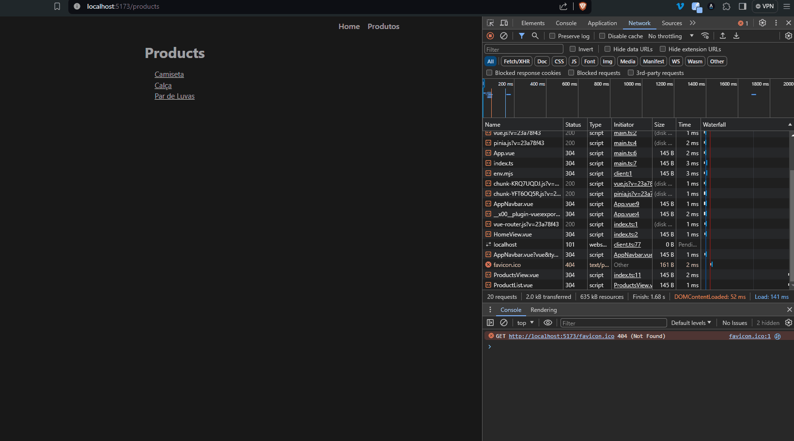

# Hooks

## Tabela de conteúdo

- [Introdução](#introdução)
- [beforeCreate](#beforecreate)
- [created](#created)
- [beforeMount](#beforemount)
- [mounted](#mounted)
- [beforeUpdate](#beforeupdate)
- [updated](#updated)
- [beforeUmount](#beforeunmount)
- [unmounted](#unmounted)
- [Exemplo](#exemplo)

## Introdução

Hooks são métodos que são executados em determinados momentos do ciclo de vida do componente. Eles são úteis para realizar ações específicas em determinados momentos.

Daremos uma breve introdução sobre os principais hooks do ciclo de vida de um componente e como utilizá-los.

## beforeCreate

O hook `beforeCreate` é executado antes do componente ser criado. Neste momento, o componente ainda não foi instanciado e as propriedades ainda não foram inicializadas.

```javascript
  beforeCreate() {
    console.log('beforeCreate')
  }
```

## created

O hook `created` é executado após o componente ser criado. Neste momento, o componente já foi instanciado e as propriedades já foram inicializadas.

```javascript
  created() {
    console.log('created')
  }
```

## beforeMount

O hook `beforeMount` é executado antes do componente ser montado no DOM. Neste momento, o componente já foi criado e as propriedades já foram inicializadas.

```javascript
  beforeMount() {
    console.log('beforeMount')
  }
```

## mounted

O hook `mounted` é executado após o componente ser montado no DOM. Neste momento, o componente já foi criado, montado e as propriedades já foram inicializadas.

```javascript
  mounted() {
    console.log('mounted')
  }
```

## beforeUpdate

O hook `beforeUpdate` é executado antes do componente ser atualizado. Neste momento, o componente já foi criado, montado e as propriedades já foram inicializadas.

```javascript
  beforeUpdate() {
    console.log('beforeUpdate')
  }
```

## updated

O hook `updated` é executado após o componente ser atualizado. Neste momento, o componente já foi criado, montado e as propriedades já foram inicializadas.

```javascript
  updated() {
    console.log('updated')
  }
```

## beforeUmount

O hook `beforeUmount` é executado antes do componente ser desmontado do DOM. Neste momento, o componente ainda está montado e as propriedades ainda estão inicializadas.

```javascript
  beforeUmount() {
    console.log('beforeUmount')
  }
```

## unmounted

O hook `unmounted` é executado após o componente ser desmontado do DOM. Neste momento, o componente já foi desmontado e as propriedades já foram destruídas.

```javascript
  unmounted() {
    console.log('unmounted')
  }
```

## Exemplo

```vue
<template>
  <div>
    <ProductDetail :id="productId" />
  </div>
</template>

<script setup lang="ts">
import { onMounted, onBeforeMount, onBeforeUnmount } from 'vue'
import ProductDetail from '@/components/ProductDetail.vue'
import { useRoute } from 'vue-router'

const route = useRoute()
const productId = Number(route.params.id)

// #1 Hook beforeMount
onBeforeMount(() => {
  console.log('Component is about to be mounted to the DOM.')
})

// #2 Hook mounted
onMounted(() => {
  console.log('Component has been mounted to the DOM.')
})

// #3 Hook beforeUnmount
onBeforeUnmount(() => {
  console.log('Component is about to be unmounted from the DOM.')
})
</script>
```

Neste exemplo, utilizamos os hooks `onBeforeMount`, `onMounted` e `onBeforeUnmount` para logar mensagens no console em determinados momentos do ciclo de vida do componente.

Resultado:


